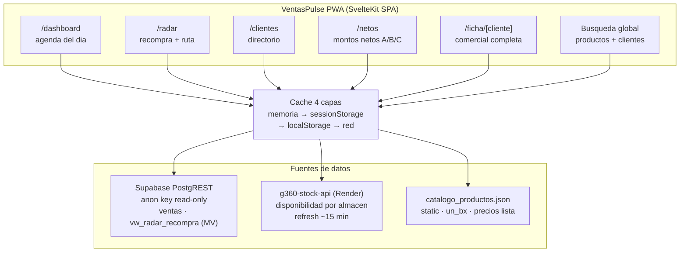
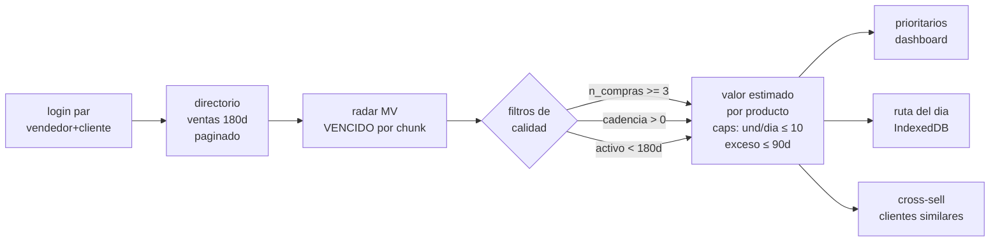
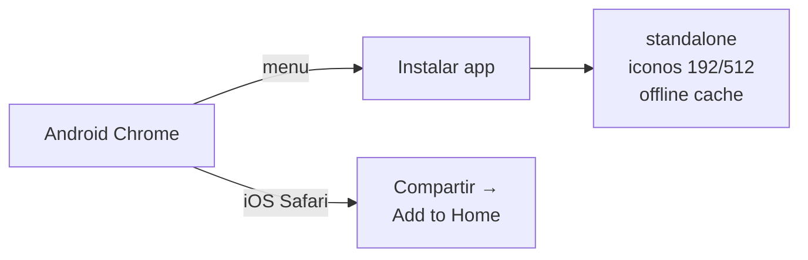

# g360-ventas-pulse — VentasPulse CIPSA

> Cockpit de campo para vendedores — PWA estática (SvelteKit + adapter-static + GitHub Pages).
> Dashboard diario, radar de recompra granular, ficha comercial completa, análisis de precios
> con detección de anomalías, stock en tiempo real y búsqueda global.
> Scaffold heredado de `g360-return-form`; assets PWA de `g360-stock-reporter-lit`.

[](https://github.com/carloscus/g360-cli)
[](#instalacion-pwa)
[](openspec/)

---

## Arquitectura



## Pipeline de datos



## Módulos

| Ruta | Módulo | Fuente |
|------|--------|--------|
| `/` | Login doble input (vendedor + cliente de cartera) | `ventas` (índice vendedor+cliente) |
| `/dashboard` | Agenda del día: prioritarios, próximos a recompra, alertas, "Cómo voy" | radar MV + stock + ventas |
| `/clientes` | Directorio del vendedor (180 días, offline-first) | `ventas` |
| `/ficha/[cliente]` | Tabla por SKU, resumen comercial, evolución mensual, precios anual + anomalías, comparativa entre clientes, export xlsx de 5 hojas con fórmulas vivas (Resumen, Ficha SKU, Negociación, Comparativa Pareto, Historial ERP) | vista historial + stock + catálogo |
| `/radar` | Oportunidades VENCIDAS priorizadas + ruta del día persistente | radar MV + stock |
| `/netos` | Montos netos jerárquicos (cliente → línea → SKU) comparando 3 periodos (A, B=−1a, C=−2a) con variación | `ventas` (3 consultas por periodo, signos ERP) |

Navegación inferior persistente (`AppChrome` + `lib/navigation/modules.js`) enlaza
Hoy · Radar · Netos · Clientes; la ficha pertenece al módulo Clientes.

## Convenciones

- **Nombres**: componentes PascalCase, funciones camelCase, clases CSS kebab-case (`glass-card`, `btn-primary`, `badge-*`)
- **Moneda**: montos **sin IGV** (precios ERP); componente `MontoTooltip` muestra `Con IGV (+18%)` al tap (constante `IGV_PORCENTAJE: 0.18`, igual que order-xlsx)
- **Códigos**: clientes/vendedores display sin prefijo `01` (`01186` → `186`, `01O01` → `O01`); **SKUs nunca se recortan** (`011019` ≠ `11019`)
- **Formato**: `es-PE`, `S/` con `Intl.NumberFormat`
- **Cache**: memoria (5 min, también expira) → sessionStorage (5 min) → localStorage (7 días) → red;
  snapshot de stock con fallback stale (badge "obsoleto"). **Pull-to-refresh y botón ↻ fuerzan red**
  (`cachedGet force`): saltan las 3 capas, refrescan y sobre-escriben el cache; si la red falla
  caen al cache viejo. Abrir una página usa cache; jalar/↻ = datos frescos garantizados.
- **Netos**: montos con decimales (`fmtSoles`, 2 decimales) — el ERP audita al centavo
  (S/ 4,661.94); variación Δ en %.
- **Táctil**: targets ≥ 44px, inputs 16px (anti-zoom iOS), filas completas tappable con `active:scale`
- **Datos**: paginación offset con desempate `folio_unico` (evita duplicados entre páginas)
- **Excel**: las fórmulas vivas del export requieren Excel/LibreOffice al abrir (`fullCalcOnLoad`);
  visores web/móviles que no calculan muestran los `result` cacheados o celdas vacías.
  La comparativa del export solo cubre el Pareto (~80% del saldo, máx 20 SKUs), no todos los SKUs.

## Límites conocidos

- **Confidencialidad por vendedor (freno de cliente, no seguridad)**: la ficha
  bloquea clientes fuera de la cartera del vendedor activo (ventana 365d) y el
  login bloquea 3 minutos tras 2 intentos fallidos (persistente en
  localStorage). Con anon key pública el backend no puede exigir identidad;
  la garantía real de confidencialidad llega con Supabase Auth + RLS por
  vendedor (Fase 4 del PLAN).

- **Comparativa por SKU**: la vista y el export consultan ventas del vendedor por un SKU a la vez
  (paginado, cap 10k filas); para SKUs de altísimo movimiento puede quedar parcial.
- **Análisis anual**: solo SKUs con ≥3 ventas en 4 años (`MIN_VENTAS`); SKUs de baja rotación
  no tienen moda/promedio anual, solo último precio.
- **Historial de precios**: clientes grandes (>1000 filas) caen a rebanadas mensuales en tandas de 8;
  si un mes falla, la sección muestra "datos parciales" en vez de bloquear.
- **Netos B/C**: rangos muy largos pueden exceder el timeout del statement; la página avisa
  "Comparativo B/C incompleto" y sugiere acortar el rango.
- **Frescura de datos (Netos)**: la página muestra "Datos al {max fecha}" del periodo A y, en un
  refresh con la misma ventana, informa "Sin cambios" o "Datos actualizados (Δ lineas/S/)"
  comparando una huella local `{n, sum, min, max}` en sessionStorage. Detecta movimiento del
  dataset, NO datos mal cargados (ej. clientes ausentes de la réplica: TRUJILLO/VASCO/R&R Jun-Sep
  2026). La señal canónica será `synced_at` de `g360-ventas-db`; el badge migrará a ese campo
  cuando exista.

## Estructura

```text
src/
├── routes/
│   ├── +page.svelte          login doble input
│   ├── dashboard/            agenda del dia
│   ├── clientes/             directorio
│   ├── ficha/[cliente]/      ficha + aggregation.js
│   ├── netos/                montos netos jerarquicos A/B/C
│   └── radar/                radar + ruta
├── lib/
│   ├── api/                  postgrest, cache, clientes, radar, netos,
│   │                         stock, precios, fichaComercial,
│   │                         dashboard, ventasResumen, catalogo
│   ├── components/           ProductSearchModal, IgvCalculator,
│   │                         G360Signature, ThemeToggle, PWAInstallPrompt
│   ├── export/               fichaXlsx (ExcelJS, 5 hojas: Resumen con
│   │                         KPIs/evolución de fórmulas vivas, Ficha SKU
│   │                         completa con modas, Negociación, Comparativa
│   │                         Pareto+ranking, Historial ERP nc-sustentor)
│   ├── stores/               vendedor, ruta, contexto
│   ├── db/                   cockpitDB (IndexedDB v2)
│   ├── utils/                format, display, igv
│   └── _legacy/              scaffold devoluciones (fuera del bundle)
└── core/                     skill.json (branding G360)
```

## Instalación PWA



## Desarrollo

```bash
npm install
npm run dev        # vite dev (puerto por defecto)
npm run build      # build/ estático (adapter-static + PWA SW)
npm run preview    # preview del build
```

Variables de entorno (copiar `.env.example` → `.env`):

| Variable | Uso |
|----------|-----|
| `VITE_SUPABASE_URL` | PostgREST base |
| `VITE_SUPABASE_ANON_KEY` | anon key read-only |
| `VITE_STOCK_API_URL` | stock API base |
| `VITE_STOCK_API_KEY` | stock read key |

## Deployment

```bash
npm run build
git push   # GitHub Actions deploya a Pages (workflow heredado)
```

Base path: `/g360-ventas-pulse` · repo: `g360-ventas-pulse` · Pages desde Actions.

## OpenSpec

Especificaciones y cambios en `openspec/` (schema `spec-driven`). Fases A–D
implementadas y archivadas; ver `PLAN.md` para el roadmap y los principios
adoptados del plan Asistente Comercial.

## G360 Ecosystem

Proyecto hermano de [g360-stock-reporter-lit](https://github.com/carloscus/g360-stock-reporter-lit)
(misma familia de PWA de campo CIPSA) y `g360-ventas-db` (fuente de datos
Supabase). Signature: *powered by G360*.

